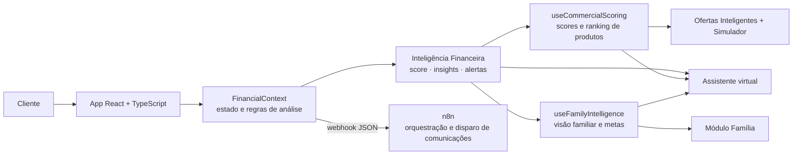

<h1 align="center">💳 HMSBANK · Plataforma de Inteligência Financeira e Análise de Clientes</h1>

<p align="center">
  MVP de um app bancário que transforma os gastos do cliente em <b>insights</b>, <b>alertas</b>, <b>scores comerciais</b> e <b>ofertas personalizadas</b>,<br>
  com uma visão consolidada da família e automações orquestradas no <b>n8n</b>.
</p>

<p align="center">
  
  
  
  
  
  
  
</p>

<p align="center">
  <a href="https://lnkd.in/dT_4TEqc"><b>▶ Ver o protótipo funcional</b></a> ·
  <a href="https://lnkd.in/dQJfCWSa"><b>🧭 Fluxo e arquitetura</b></a>
</p>

---

> **Nota:** "HMSBANK" é uma marca fictícia, criada para portfólio. Saldos, cartões, familiares e produtos são dados simulados.

## 🎯 O problema

Os bancos têm muitos dados de consumo dos clientes, mas quase sempre usam isso de forma genérica: a mesma oferta vai para todo mundo, e o cliente não recebe nada que o ajude a organizar a própria vida financeira.

O HMSBANK inverte essa lógica. Primeiro o app **gera valor para o cliente**, com diagnóstico, alertas e evolução dos gastos. A partir desse mesmo diagnóstico, o banco calcula **a propensão do cliente a cada produto** e faz uma oferta com justificativa clara.

## 🧱 Os três pilares (MVPs)

### 1. Inteligência Financeira
- O cliente informa os **gastos mensais** em 8 categorias: água, luz, mercado, escola, aluguel, transporte, lazer e outros.
- **Score de organização financeira** (0–100), calculado a partir da proporção entre gastos fixos e variáveis, da consistência dos dados, da evolução mês a mês e dos alertas críticos.
- **Evolução mês a mês:** cada categoria é classificada como *melhorando*, *estável* ou *em risco*.
- **Insights automáticos:** resumo do mês, maior categoria, peso do lazer e composição entre gastos fixos e variáveis.
- **Alertas** para aumentos acima de 20% (acima de 40% é severidade alta), que o cliente pode marcar como resolvidos.
- **Economia potencial** estimada a partir de padrões de consumo.

### 2. Ofertas Inteligentes
- **5 scores comerciais** derivados da análise: Investimento, Crédito, Planejamento, Proteção e Consumo.
- **Ranking de 8 produtos** (CDB, Tesouro Selic, fundos, previdência, crédito, cartão e seguro) por compatibilidade e **probabilidade de conversão**.
- **Oferta prioritária** com o motivo explicado, o perfil do cliente, o valor sugerido e os gatilhos de conversão.
- **Cross-sell** com os próximos 3 produtos e um **simulador** de valor, prazo e retorno.

### 3. Planejamento Familiar
- **Núcleo familiar:** cônjuge, filhos e dependentes, cada um com renda e gastos próprios.
- **Score familiar**, perfil comportamental (conservador, moderado ou agressivo), estabilidade, previsibilidade e nível de risco.
- **Dashboard consolidado:** renda, gastos, investimentos, reservas, patrimônio e taxa de poupança da família.
- **Metas familiares** (educação, moradia, aposentadoria e outras) com acompanhamento de progresso, além de **ofertas familiares** como previdência, carteira diversificada, proteção e crédito.

### ➕ Assistente virtual
Um chatbot que responde com base na análise do próprio cliente: ofertas, scores, família, metas, alertas e gastos.

## 🏗️ Arquitetura



- **Regras de análise centralizadas** num Context do React (`FinancialContext`), que as telas consomem.
- **Hooks de domínio** separam o motor comercial (`useCommercialScoring`) da inteligência familiar (`useFamilyIntelligence`).
- **Integração com o n8n:** ao gerar a análise, o app envia os gastos e o resultado para um webhook do n8n, que orquestra o processamento e o disparo de comunicações.
- **Tipagem forte** dos domínios em `src/types/` (`financial`, `offers` e `family`).

## 🖥️ Telas

| Tela | O que mostra |
|---|---|
| **Início** | Saldo, agência e conta, operações rápidas (Pix, TED, boletos, cartões, extrato e recarga) e cartões |
| **Gerar Análise** | Formulário de gastos por mês e categoria |
| **Dashboard Financeiro** | Score, evolução, comparativo mensal e gráficos |
| **Insights** e **Alertas** | Descobertas automáticas e alertas com status |
| **Ofertas Inteligentes** | Scores comerciais, oferta prioritária, ranking, cross-sell e simulador |
| **Família** | Núcleo familiar, score familiar, metas e ofertas para a família |
| **Assistente** | Chat que responde com base nos dados do cliente |
| **Configurações** | Notificações, frequência e automações |

O app tem **tema claro e escuro** e layout responsivo.

## 🚀 Como executar

```bash
git clone https://github.com/HagataMendes/hmsbank.git
cd hmsbank
npm install
npm run dev     # http://localhost:8080
npm run build   # build de produção em dist/
npm test        # testes com Vitest
```

## 📁 Estrutura

```
src/
├── pages/            telas (Dashboard, Análise, Ofertas, Família, Chat…)
├── components/
│   ├── dashboard/    cabeçalho da conta, cartões, operações rápidas
│   ├── analysis/     formulário de gastos
│   ├── offers/       simulador de produtos
│   ├── chat/         assistente virtual
│   ├── layout/       menu lateral e layout
│   └── ui/           componentes de interface (shadcn/ui + cards próprios)
├── contexts/         FinancialContext (regras de análise) e ThemeContext
├── hooks/            useCommercialScoring, useFamilyIntelligence
└── types/            modelos de domínio: financial, offers, family
```

## 🛣️ Próximos passos

- Persistir os dados no Supabase, com autenticação e RLS.
- Trocar as regras heurísticas por modelos de propensão treinados com dados históricos.
- Substituir o assistente por regras por um LLM com RAG sobre a análise do cliente.

## 👩‍💻 Autora

**Hágata Mendes**, Analista de Dados Sênior
[LinkedIn](https://www.linkedin.com/in/hagatamendes/) · [GitHub](https://github.com/HagataMendes)

<sub>Criado com apoio do <a href="https://lovable.dev">Lovable</a>.</sub>
